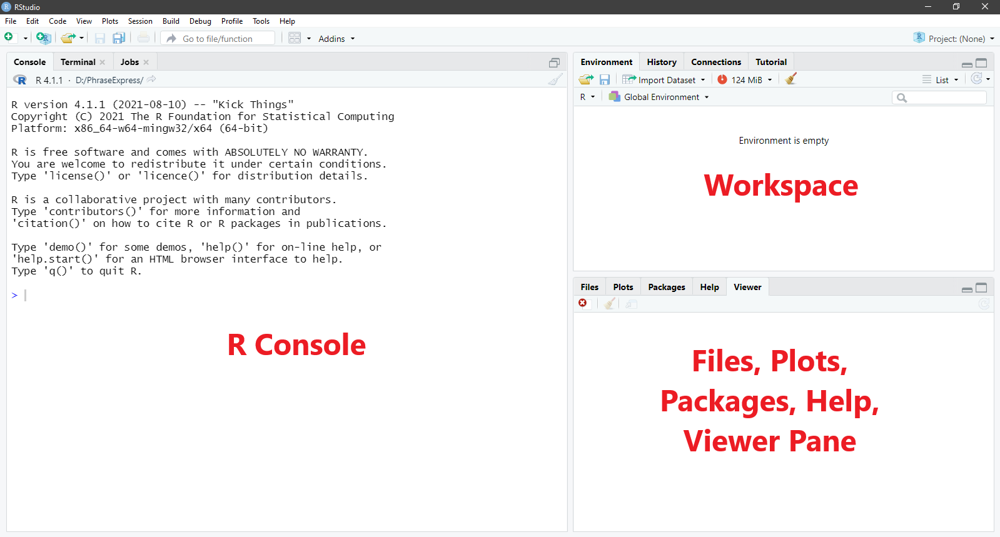
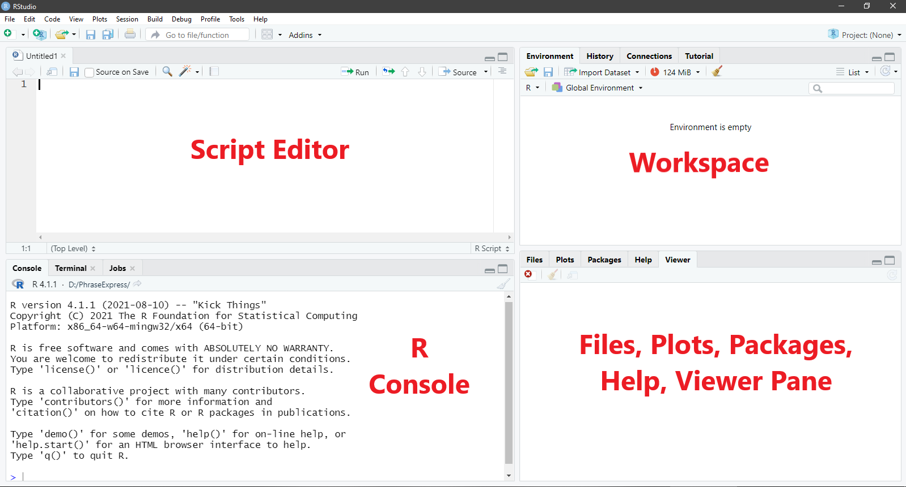
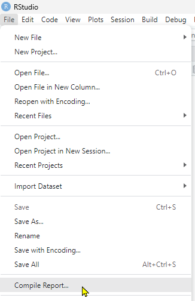
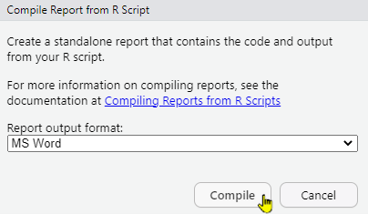

# Getting Started {#start}

To analyse data in R, you need both R and RStudio. These are *different* programmes. Think of R as the software that executes our commands and RStudio as the interface between us and R that makes interacting with R a much more pleasant experience. If that doesn't make sense, here's a (hopefully relatable) example.

Imagine you went to a hawker centre and there's an uncle manning the store. This uncle can only speak Hokkien but you can't. So, you tell your friend, who can speak Hokkien, what you want. Then, your friend translates that for the uncle, who then serves up a delicious meal for you. Think of the uncle in this example as R and your friend as RStudio. While you can try to "converse" with R directly, it's much easier to do so through RStudio. So... For the sake of your sanity, I strongly recommend you download both programmes!

## Install R and RStudio

### Install R

For Windows

1.  Open an internet browser and go to <https://cloud.r-project.org/>.
2.  Under **Download and Install R**, click on **Download R for Windows**. Click on **base**.
3.  **Download the latest release** by saving the .exe file on your computer. **Double-click the file and follow the installation instructions**.

For macOS

1.  Open an internet browser and go to <https://cloud.r-project.org/>.
2.  Under **Download and Install R**, click on **Download R for macOS**.
3.  **Download the latest release** by saving the .pkg file to your computer. **Double-click the file and follow the installation instructions**.

### Install RStudio

Now that R is installed, download and install RStudio.

1.  Go to <https://docs.posit.co/ide/user/#rstudio-ide-oss-downloads>.
2.  Click the **download link for your operating system** (e.g., Windows or macOS).
3.  Save the file. **Double-click the file and follow the installation instructions**.

## The RStudio Interface

Now, start up RStudio. You should see something like this:

```{r 001-threepane, echo = FALSE, out.width = "100%", fig.cap = "R Studio Interface With Three Panes"}



```

When you first start up RStudio, you will see three panes: the R console, the workspace, and the files, plots, packages, help, and viewer pane. Each pane serves different purposes.

1.  **R console**: The R console is where commands are submitted to R for R to execute. It is also where we find some of the output from R (e.g., analysis results).
2.  **Workspace**: I think of this as R's short-term memory. There are two tabs that are particularly useful.
    - **Environment tab**: We can find the list of objects (e.g., variables, data frames, functions) that we created in the session here.
    - **History tab**: Here is where we can find all the previous commands we submitted to R in the session.
3.  **Files, plots, packages, help, and viewer**:
    - **Files**: We can create new folders on our computer, move, delete, and rename files here.
    - **Plots**: We can find all the plots we instructed R to produce during the session here.
    - **Packages**: We can find, install, and update packages here. Packages contain data, functions, help menus, etc. that other people have created to supplement those in R. We will talk more about specific packages later.
    - **Help**: We can find information about a given command or package. We can also find more information about various commands and the packages on this website: <https://www.rdocumentation.org/>

*Note.* Because the Terminal tab, the Connections tab, and the Viewer tab will not be used in this course, I will not talk about them.

## R Script

To get R to do stuff (e.g., conduct analyses), we submit commands to R through RStudio. Although we can type the commands directly into the console, R users prefer to type the commands into what is called the script editor because we can save the commands in the script editor into script files (with the extension .R). The script files allow us to keep long-term records of the analyses that we have conducted. We can also share the script files with other R users so that they can reproduce our analyses. (In this class, I will use the words command and code interchangeably.)

To open a blank R script, go to **File \> New File \> R Script**. Or, you can use the shortcut Ctrl + Shift + N (Windows) or Cmd + Shift + N (macOS). Notice that now, your RStudio has four panes. The script editor should now take up the top half of the left hand side of the screen as shown below.

```{r 002-fourpane, echo = FALSE, out.width = "100%", fig.cap = "R Studio With  Four Panes"}



```

## Some Tips and Tricks

Before we start coding proper, here are some tips to help you along your R journey. (These are things I wish I knew when I first started out!)

### Softwrap Long Lines

Sometimes, we might write commands in the Script editor section that are too long (horizontally) to fit the window. To see the entire command, we might need to scroll left and right. This can be frustrating. (It's like Notepad, without word wrap.) Fortunately, we can wrap the text such that the code fits into the size of the window. Go to **Code \> Soft Wrap Long Lines**. I highly recommend you do this, especially if you tend to write a lot of comments in the script file like I do.

### Make Notes or Comments

In R (and most programming languages), you can write notes or comments in the script to yourself and your readers. This is done in R by starting the line with a `#` sign.

```{r eval = FALSE}

# This is a comment. 

```

Please make *liberal* use of comments. I cannot tell you how many times comments have helped me understand what I'm doing and why. Your future self will thank you. Trust me.

### Multi-Line Comments

To make your super long comments readable, you may break them into several lines, starting each line with `#>`.

```{r eval = FALSE}

#> This is a comment
#> that has been broken
#> into multiple 
#> lines.
#> :) 

```

### Create Code Sections in R Script

Often times when we are analysing data, we need to include multiple steps. It can feel incredibly confusing and overwhelming to navigate a long R script. We can use code sections to organise and structure the code, by grouping related tasks together. This way the R script is easier to navigate.

To insert a new code section, start the line with \# and then use any of the following: *at least* four trailing dashes (-), equal signs (=), or pound signs (\#).

```{r eval = FALSE}

# Section One ---------------------------------
# Section One ----

# Section Two =================================
# Section Two ====

### Section Three ############################# 
### Section Three ####

```

To fold all code sections (i.e., hide the content within all sections, leaving only the section header for navigation), go to **Edit \> Folding \> Collapse All** (the shortcut is `Alt + O`). To expand all code sections (i.e., show all content), go to **Edit \> Folding \> Expand All** (the shortcut is `Alt + Shift + O`).

### Setting Working Directory

Typically when we analyse data, we need to reference external files (e.g., our data files). To tell R where to look for those data files, we need to specify the full file path (i.e., the file location). While this is fine if you only have one or two things to reference, it can be kind of tedious to keep typing the file path if you have many things to reference. Furthermore, if you choose to change your file location, it would be quite a hassle (and also error-prone) to have to update all those file paths in the script.

What we can do instead is to set a working directory in R using the function `setwd()`. This tells R where your data files are stored for the session, so it will know to look there. It will also be the place that R saves any output (e.g., plots).

To get the file location in Windows, we first go to the folder where the file is located, right-click on the address bar, and click **Copy address as text**. We then need to convert the backslashes in the file path to forward slashes before we can use it. Let's say the file path is `C:\Users\Win10\Desktop\R`. After converting all the backslashes to forward slashes, the file path to use is `C:/Users/Win10/Desktop/R`.

In macOS, there are several ways to get the file path. For instructions, please visit this website: <https://www.dev2qa.com/how-to-get-file-path-in-mac/>. Note that the file paths in macOS already use forward slashes, so changing backslashes to forward slashes is not an issue for macOS users.

After getting the file path, you can then set the working directory as follows, with the file path encased in open/close inverted commas, within the parentheses.

```{r eval = FALSE}

# Set working directory
setwd("C:/Users/Win10/Desktop/R")

```

Another (perhaps easier) way to set working directory is to go to **Session \> Set Working Directory \> Choose Directory**. Then, select the folder you want to set as your working directory. This process needs to be repeated for each session (i.e., each time you start up RStudio).

If you want to set a default working directory, go to **Tools \> Global Options \> General \> Default working directory (when not in a project) \> Browse**. Then, select the folder you want to set as your default working directory.

### Using RStudio Projects

While setting the working directory manually is sufficient when we have only one or two projects, many of us have multiple projects on-going at the same time. If we have a bunch of different files from different projects all strewn in a single directory (folder), it can get quite messy. To stay organised, it is preferable that we create an RStudio project for each project we are working on. This allows us to group the files related to a single project (e.g., data, output) together.

To do this, go to **File \> New Project**. A dialogue window with three options, "New Directory", "Existing Directory" and "Version Control", will appear. From here, you may choose either "New Directory" or "Existing Directory". If you chose "New Directory", R will create a new folder and create an R project within that new folder. If you chose "Existing Directory", R will create an RStudio project within an existing folder that you specify. Either will work, but I usually select "Existing Directory" as I would already have created my own folder to house materials related to a specific project.

After RStudio has created the project, it will change the working directory to the project directory so that you can access all the files (e.g., data, script) related to this project in this directory. RStudio will also create a file with the extension .Rproj in the project directory. When you open this file, RStudio will automatically start a new session with the project directory as your working directory.

While it is not necessary to use RStudio projects in my classes, I recommend it because it will help keep you organized.

### Compile Report

The "Compile Report" feature in RStudio generates a formatted document from your R script. It integrates code and output into a single document that can be easily shared. To compile a report, go to **File \> Compile Report...**.

```{r 003-compile1, echo = FALSE, out.width = "50%", fig.cap = "Compile Report Step 1"}



```

Although there are several different formats you may choose (e.g., PDF, Word, HTML), I find that compiling the report into Word format works best for my classes. So, under **Report output format:**, choose **MS Word**. Then click **Compile**.

```{r 003-compile2, echo = FALSE, out.width = "50%", fig.cap = "Compile Report Step 2"}



```

### Debugging

When you are programming, you will make errors ("bugs") in your code. Trying to figure out where you made the error ("debugging") can be extremely time-consuming and frustrating. To help you along, here are some of the most common bugs that you'll run into.

1.  Misspelled object or function
    - Misspelled object (e.g., condition vs condtion) will throw this error message: *Error: object not found*
    - Misspelled function (e.g., `t.test` vs `ttest`) or trying to use functions in packages that have not been loaded yet will throw this error message: *Error: could not find function*
    - R is case-sensitive. So if your object is called *Dataset*, you need to type *Dataset* and not *dataset*, else it will throw an error message.
    - If you're referring to a variable in the dataset, you must attach the `$` sign (e.g., dataset\$variable). Otherwise, R will tell you it cannot find the object.
2.  Punctuation mistake
    - Remember to close the parenthesis ()
    - Don't add a space where there shouldn't be. For example, if your object is called *dataset*, don't type *data set*.
    - Use the correct punctuation for the function. For example, if the function requires a comma, don't put in full stops. If it requires a double equal sign, don't put in a single equal sign.

If you've tried all the above and still can't figure out what's going on, just copy and paste the warning into the search engine or large language models (LLMs). 99% of the time, you'll be able to figure out what happened by reading the responses.

And speaking of LLMs...

### On Using LLMs

I understand that this is the first time that some of you are using R. It can be quite intimidating. Fortunately, LLMs are *very* good at both generating code and interpreting the output. (This is so different from my time when I had to scour the forums to figure out what had gone wrong!)

The problem with LLMs is that they can lead you on a wild goose chase if you do not give them sufficient context. So, here are some things I've learnt that I think might be helpful.

1.  **Give LLMs the full context.** The LLM typically doesn't know if a variable is a categorical variable or a quantitative one unless you tell it explicitly. (Of course, it can guess, but what if it guesses wrong?) It also won't know about your previous decisions (e.g., you decided to use dummy vs effects coding). If it doesn't know all these things, its interpretation of the output will be erroneous. Oh, and if you don't tell it you want R code, it is likely to give you Python code. So make sure you give it the full context.
2.  **There are many ways of doing the same thing. Don't always accept the first set of code it gives you.** Due to the nature of my work, I typically prefer code that I can read and explain to someone else. So, if the LLM gives me a code that I don't understand or is too complex, I will ask for a simpler or different one. LLMs love giving me loop functions for things that can be done easily with the `map()` function from `tidyverse`, for example. (As an aside, usually I'll ask if it could give me a code in "tidyverse", as I find the "tidyverse" codes to be easier to understand.)
3.  **Verify the code does what it's supposed to do.** Obviously, you need to check that the code runs properly and gives you the desired outcome. If it doesn't, copy the error message back into the LLM and ask it to de-bug. It usually does okay with de-bugging. However, I have, at times, found that it doesn't give correct explanations for why the errors appear. This is especially if the error is due to statistical issues (e.g., I forgot to convert a categorical variable into a factor so R thought it was a numeric / quantitative one). In such cases, you'll have to rely on your statistical understanding to de-bug. Other times, it's just a stupid typo (e.g., in the previous part of the code, I typed model1 and then 100 lines later, when referring to it in a subsequent code, I typed mod1). Unless R has all the code you typed, it won't pick that up either.
4.  **Verify (almost) everything it says.** Do not trust the LLM's responses *prima facie*. Always ask for references. *And always click through to the references to check.* I have, on countless occasions, checked and found out the LLM was just hallucinating (i.e., the reference never stated whatever the LLM said it did), even in 2026, as of time of writing Or, the LLM output was just based on a single person's dissenting opinion on the web, and the LLM reported it as if it were scientific consensus. (There is currently sufficient research showing that LLMs' output can be "poisoned" by just a single Reddit post or a webpage.) So always click through to verify. Of course, there are some things that you don't have to verify if you already know them to be true or you don't really care about the veracity. :)
5.  **Do not trust the LLM's reasoning unless it coheres with your own or you're able to independently confirm the reasoning.** It is very tempting for a novice to think, "The reasoning seems to make sense on the surface. I don't know any better. ¯\\\_(ツ)\_/¯ I'll accept it then!" I have caught myself falling into that trap countless of times. It's only when I make myself go through the reasoning step by step that I realised the LLM was inconsistent or out-right wrong. An LLM once told me -0.75 + 1 = 0 and I didn't catch it until I worked through the calculation myself! If you find yourself stuck in a loop with the LLM, with it insisting it was right and you're wrong (happens to me a lot), it helps to start a new chat or to switch to a different model or an entirely different LLM. (I found that asking at different times yielded different reasoning and conclusions!)
6.  **Saving tokens.** AI companies are now trying to turn a profit. As a result, they're starting to restrict the amount of tokens you have under the free version. Broadly speaking, tokens are words or part of words. The longer the query and/or the LLM output, the more tokens it will use. There are three ways to reduce tokens spent. 1) Use Caveman mode (see Caveman mode instructions below), 2) Start a new chat when possible, 3) Use the normal model for most tasks.
    1.  **Caveman mode instructions (put this under personalisation or at the beginning of chat)**: Unless otherwise told, you will respond in Caveman Mode. You will use short, primitive sentences. Drop all filler words (like "the", "a", "of"), pleasantries, apologies, and explanations. Give only facts and direct commands. Retain full technical accuracy, but keep output as dense and short as possible.\
        *Note*. I also add the following: "Where possible, provide sources for claims made in your responses."
        - This pushes the LLM output to be short and direct. To de-activate this, type "Use normal mode." To re-activate it (LLMs can start forgetting they were supposed to respond in Caveman mode after a while and revert to normal behaviour), type "Use Caveman mode."
    2.  **Start a new chat.** When you ask additional questions in the same chat, the LLM essentially references everything (e.g., your previous queries, its previous responses, its previous thought process) to answer your question. So, the more questions you ask within the same chat, the more tokens used each time. I recommend to start a new chat, if you can. Yes, you have to provide context all over again, but let's face it, not every response from the LLM was useful anyway and not every query was relevant. (See explanation from a computer science prof on why AI tokens are expensive [here](https://youtu.be/-0HRzXk8vlk?si=FXfdv3P5wTYJCcSL).)
        - Yes, I know about prompt caching. But prompt caching only works if you ask a follow-up question reasonably quickly after the initial question. If you wait longer in between queries, that cache gets erased. Mike Pound, the prof in the video, talks about this as well.
        - Some LLMs may choose to reference only the last X number of messages, reducing the number of tokens used. I don't know which LLMs do that. The start new chat method I recommend here works more generally.
    3.  **Use the basic LLM model.** For most coding questions, you don't need the most advanced model. Save your tokens for questions that *really* require the compute.

### (Optional) Style Guide

I strongly believe that people should be able to reproduce each others' analyses. This provides the checks and balances that is important for science to advance. Therefore, you should be willing and able to share your code. But even if you do share your code, if it is unintelligible, it will not be of much help. Therefore, to make your code understandable, in addition to writing comments in the script, you should also try to follow certain conventions when writing code. These conventions are laid out in the tidyverse Style Guide. You can read the Style Guide here: <https://style.tidyverse.org/syntax.html>.

Now that you've installed R and RStudio, let's move on to some basics! =D
