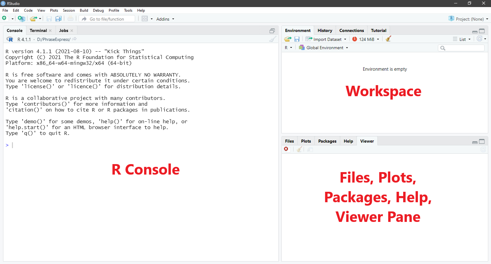

--- 
title: "PSYC208 Take Home Assignments"
author: "Huey Woon LEE"
date: "`r Sys.Date()`"
site: bookdown::bookdown_site
# output: bookdown::gitbook
documentclass: book
bibliography: [book.bib, packages.bib]
biblio-style: apalike
link-citations: yes
github-repo: hueywoon/assignment
description: "This website contains materials related to the take home assignments used in my PSYC208 class."
---

# About This Website {-}

This website contains materials related to the take home assignments used in my PSYC208 class. These assignments are graded on a PASS/FAIL basis. If the assignment is correctly done, the assignment is marked as PASS; otherwise, it is marked as FAIL. Unless there are exceptional circumstances (please inform TA or me), responses submitted after a grace period of 5 minutes will also be graded as FAIL. 

To complete the take home assignments, you need both R and RStudio. I like to think of R as the software that executes your commands, and RStudio as the interface between us and R that makes interacting with R much easier. You can run R commands independent of RStudio, but you _cannot_ run R commands with just RStudio. 

# Getting Started {-}

## Install R and RStudio {-}

### Install R {-}

### (A) Windows {-}

1.	Open an internet browser and go to [https://cloud.r-project.org/](https://cloud.r-project.org/).
1.	Under *Download and Install R*, Click on *Download R for Windows*. 
1. Download the latest release by saving the .exe file on your computer. Double-click the file and follow the installation instructions.  

### (B) macOS {-}
1.	Open an internet browser and go to [https://cloud.r-project.org/](https://cloud.r-project.org/).
1.	Under *Download and Install R*, click on *Download R for macOS*. 
1.	Download the latest release by saving the .pkg file to your computer. Double-click the file and follow the installation instructions.  

### Install RStudio {-}

Now that R is installed, download and install RStudio. 

1.	Go to  [https://www.rstudio.com/products/rstudio/download/](https://www.rstudio.com/products/rstudio/download/).
1.	Click *Download` under `RStudio Desktop*. 
1.	Click on the version recommended for your system, or the latest Windows / macOS version, and save the  file. Double-click the file and follow the installation instructions. 

## Start-Up RStudio {-}

Now, start up RStudio. You should see something like this: 

```{r 001-threepane, echo = FALSE, out.width = "100%", fig.cap = "R Studio With Three Panes"}



```

When you start up RStudio, you will see three panes: the R console, the workspace, and the files, plots, packages, help, and viewer pane. Each pane serves different purposes.

1.	R console: The R console is where commands are submitted to R for R to execute. It is also where we find some of the output from R (e.g., analysis results). 
1.	Workspace: We can also call this R's short-term memory. There are two tabs that are particularly useful. 
    - Environment tab: Here is where we can find the list of objects (e.g., variables) that we created in the session.
    - History tab: Here is where we can find all the previous commands we submitted to R in the session. 
1.	Files, plots, packages, help, and viewer: 
    - Files: We can create new folders on our computer, move, delete, and rename files here.
    - Plots: We can find all the plots we instructed R to produce during the session here.
    - Packages: We can find, install, and update packages. Packages contain functions that other people have created to supplement those in R. We will talk more about specific packages throughout this class.
    - Help: We can find information about a given command or package. We can also find more information about various commands and the packages on this website: [https://www.rdocumentation.org/](https://www.rdocumentation.org/)

_Note. Because the Terminal tab, the Connections tab, and the Viewer tab will not be used in this course, I will not talk about them._


## R Script {-}

To get R to do stuff (e.g., conduct analyses), we submit commands to R. R then executes those commands. Typically, we type those commands into what is called a script editor and then send the commands from the script editor to the console. R users prefer to type the commands into the script editor because we can save the commands in the script editor into script files (with the extension .R). The script files allow us to keep long-term records of the analyses that we have conducted. We can also share the script files with other R users so that they can replicate our analyses. (In this class, I will use command and code interchangeably.)

To open a blank R script, go to _File > New File > R Script_. In Windows, the shortcut is ctrl + shift + N. So, now, your RStudio should have four panes. 

```{r 002-fourpane, echo = FALSE, out.width = "100%", fig.cap = "R Studio With  Four Panes"}

knitr::include_graphics("img/002-fourpane.png")

```

## Some basic commands {-}

It might be useful to know some of these basic commands in R. 

1.	Place a comment in the script file: Begin the line with # 
1.	Run a line in the script file: Place the cursor on the line, hit Ctrl +  Enter (Cmd + Enter)
   - If we typed the command directly into the console, we only need to hit Enter 
1.	Run multiple lines in the script file: Select the lines, hit Ctrl + Enter (Cmd + Enter)
1.	Clear the console: Hit Ctrl + L (Cmd + L)
1.	Request help: Type a question mark in front of the command or the package name (e.g., ?cor). Information about the command will appear in the Help tab (lower right pane).

## Typing Commands Into the R Script {-}

Copy and paste the following R codes into the Script Editor pane. Run each line to see what they do. Note that # denotes a comment, and therefore it will not run. Experiment and have fun! 

```{r eval=FALSE}
# Assign a value (e.g., 9) to an object, say x.  
x <- 9  # what this mean is that x gets the value of 9

# Get the value for x.
x   # Note that R is case-sensitive. If you typed X, you'll get an error message.

# If you want to know what objects are in the workspace (i.e., R's memory), look at the Environments tab or type ls().
ls()

# You may remove an object (e.g., x) from R’s memory.
rm(x)  # where rm stands for remove

# You may remove all objects from the workspace.
rm(list = ls())

# Assign a non-numerical value by putting the value in quotation marks.
y <- "hello"

# Get value of y. Notice value of y is in quotation marks, indicating it is a non-numerical value.
y

# Perform mathematical operations in R.
11 + 10
11 - 10
11 * 10
11 / 10
11 ^ 10
11 ^ (1/2)
sqrt(11)   # this number should be the same as above line
log(11)    # taking natural log (log base e) 
log10(11)  # taking log base 10
exp(11)    # taking the exponential

# Perform mathematical operations in R with an object (e.g., x). 
x <- 9  # we removed x just now, so now, we need to reassign a value to x
x + 10
x - 10
x * 10
x / 10
x ^ (1/2)
sqrt(x)
log(x)
log10(x)
exp(x)

# Perform mathematical operations with more than one object.
y <- 2  # notice that 2 now replaces the value “hello”
x + y
x - y
x * y
x / y
x ^ (1/y)
```


## Customizing RStudio {-}


### Softwrap Long Lines {-}

Sometimes, we might write commands in the Script editor section that is too long (horizontally) to fit the window. To see the entire command, we might need to scroll horizontally. This can be frustrating. (It’s like notepad, without word wrap.) Fortunately, we can wrap the text such that the code fits into the size of the window. Go to Code > Soft Wrap Long Lines. I highly recommend you do this, especially if you tend to write a lot of comments in the script file like I do. 


## Using R Projects {-}

When we analyse data, we may have a bunch of different files, such as the input data, R scripts, results, figures etc. To stay organised, it is best that we have a projects. _File > New Project_

A dialogue window with three options appears: “New Directory”, “Existing Directory” and “Version Control”. 

Select “New Directory” followed by “New Project”.

After you created a project, RStudio changes the working directory to the project directory so that you can conveniently access data and R scripts in this directory without having to manually change directories. RStudio also placed a file with the extension .Rproj in the project directory. When you open this file, RStudio automatically starts a new session with the project directory as your working directory. 

I strongly recommend you make RStudio projects a regular part of your workflow. They help you stay organised. As a rule of thumb, whenever you work on a new data set, you create a new project dedicated to these data. The project folder is where you store the data files and save all R scripts that have to do with these data. Do not hesitate to create many small projects. Projects with only a few files are much easier to navigate than projects in which many unrelated files were dumped into one and the same directory.


